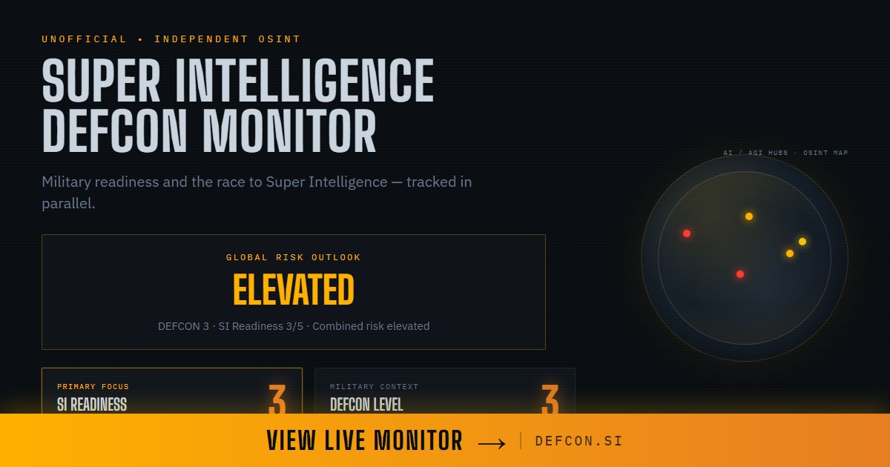

# DEFCON.si — Super Intelligence DEFCON Monitor

Real-time-style **SI (super intelligence) DEFCON board**: levels, signals, history chart. Static site — no framework build required.

**Live:** [defcon.si](https://defcon.si)




## What it is

Single-page monitor for tracking "how hot" the SI landscape feels — DEFCON 1–5, SI level, signal cards, and a history chart (Chart.js). Data can be inlined in `index.html` or loaded from `data.json` for agent/cron updates.

## Stack

| Layer | Tech |
|-------|------|
| UI | Static HTML + Tailwind CDN + Chart.js |
| Data | `CONFIG` in page or `/data.json` |
| Hosting | Netlify (see `netlify.toml`) |
| Automation | `scripts/agent-update.mjs` (optional) |

## Deploy

**Drag & drop:** Netlify Drop the folder containing `index.html`.

**Git:** Import this repo; empty build command; publish directory `/`.

**Custom domain:** Point apex/www per Netlify DNS docs.

## Editing data

Prefer `data.json` next to `index.html` (same shape as `CONFIG`). Or edit `CONFIG` in `index.html` and redeploy.

```bash
node scripts/agent-update.mjs   # refresh data.json when configured
```

## Assets

- `og-image.jpg`, `og-image-1.jpg` … `og-image-5.jpg` — social / share art  
- `favicon.svg`, apple-touch icons  

## License

All rights reserved.
